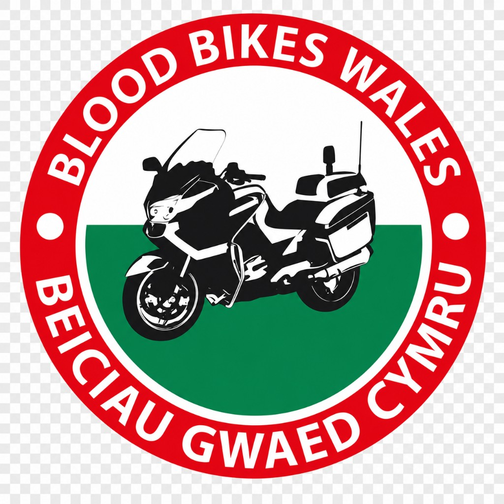

# Blood Bikes Wales — Brand Guidelines

| Version | Date | Author | Changes |
| :---- | :---- | :---- | :---- |
| 0.1 | 19 June 2026 | R. Speekenbrink, E. Flynn-Harding | First Draft |

## Table of Contents

1. [Organisation Overview](#01-organisation-overview)
2. [Brand Principles](#02-brand-principles)
3. [Colour Palette](#03-colour-palette)
4. [Typography](#04-typography)
5. [Spacing and Layout](#05-spacing-and-layout)
6. [Screen Structure and UI Patterns](#06-screen-structure-and-ui-patterns)
7. [Iconography](#07-iconography)
8. [Brand Voice and Tone](#08-brand-voice-and-tone)
9. [Dark Mode Guidance](#09-dark-mode-guidance)
10. [Accessibility Guidelines](#10-accessibility-guidelines)
11. [Developer Reference](#11-developer-reference)

---

## Logo

Official circular logo mark for Blood Bikes Wales / Beiciau Gwaed Cymru.



| | |
| :---- | :---- |
| **Asset path** | `public/brand/logo.png` |
| **Public URL** | `/brand/logo.png` |
| **Alt text** | `Blood Bikes Wales` |

### Usage

- Use the official asset above; do not recreate or alter the logo.
- **Splash screen**: centred on crimson (`#B91C1C`) background; pair with white loading indicator.
- **Headers / marketing**: preserve aspect ratio; do not stretch, rotate, or add effects.
- **Minimum size**: keep ring text legible; avoid sizes below ~80px width in UI.
- The logo includes bilingual English/Welsh text — do not crop the outer ring.

```tsx

```

---

## 01. Organisation Overview

| Attribute | Detail |
| :---- | :---- |
| **Name** | Blood Bikes Wales |
| **Type** | Volunteer charity. NHS-supporting medical courier service. |
| **Mission** | Providing free out-of-hours transport of blood, medical samples, and urgent equipment across Wales to support the NHS. |
| **Tone** | Professional, trustworthy, urgent, life-saving, yet approachable and community-driven. |
| **Audience** | Controllers, riders, and developers building tools for the charity. |

### Brand Statement

Blood Bikes Wales exists to support the NHS through dependable volunteer-led transport of urgent medical items. The brand should feel calm under pressure, operationally serious, and deeply human.

---

## 02. Brand Principles

| Principle | What it means in practice |
| :---- | :---- |
| **Dependable** | Use stable colours, clear layouts, consistent status patterns, and plain language. |
| **Urgent, not alarming** | Use crimson for identity and primary actions, but avoid visual panic or excessive red. |
| **Operationally clear** | Every screen should make the next action obvious. Status, errors, and confirmations must be direct. |
| **Volunteer-friendly** | Design for a broad age range, outdoor use, and varying levels of digital confidence. |
| **Accessible by default** | High contrast, large tap targets, visible labels, and predictable navigation are mandatory. |

**Design philosophy:** Blood Bikes Wales should feel like healthcare logistics with a community heart. Calm, practical, trustworthy, and ready to act.

---

## 03. Colour Palette

The colour system is designed for clarity, accessibility, and consistent digital implementation. The swatches below are the approved values for the Blood Bikes Wales digital brand.

### Primary Colours

| Name | Hex | RGB | Usage |
| :---- | :---- | :---- | :---- |
| Crimson Red (Primary) | `#ED2F45` | rgb(237, 47, 69) | Main brand colour. Buttons, headers, splash screens, active navigation. |
| Dark Crimson | `#991B1B` | rgb(153, 27, 27) | Pressed and hover states for primary elements. |
| Light Crimson | `#FEE2E2` | rgb(254, 226, 226) | Selected states, avatar backgrounds, tag highlights. |
| Navy | `#1E3A5F` | rgb(30, 58, 95) | Area badges, secondary brand colour, structured headings, navigation. |
| Navy Light | `#2D5F8A` | rgb(45, 95, 138) | Profile info cards, secondary icons, lower-priority brand accents. |

### Semantic and Status Colours

| Name | Hex | RGB | Usage |
| :---- | :---- | :---- | :---- |
| Success Green | `#059669` | rgb(5, 150, 105) | Delivered status, sync confirmed, signature captured. |
| Success Light | `#D1FAE5` | rgb(209, 250, 229) | Success card and badge backgrounds. |
| Warning Amber | `#D97706` | rgb(217, 119, 6) | Offline banner, issue escalation warnings. |
| Warning Light | `#FEF3C7` | rgb(254, 243, 199) | Warning card backgrounds. |
| Error Red | `#DC2626` | rgb(220, 38, 38) | Form validation errors and failed actions. |
| Error Light | `#FEE2E2` | rgb(254, 226, 226) | Error state backgrounds. |

### Neutral and Grey Scale

| Name | Hex | RGB | Usage |
| :---- | :---- | :---- | :---- |
| Gray 50 | `#F9FAFB` | rgb(249, 250, 251) | App screen backgrounds. |
| Gray 100 | `#F3F4F6` | rgb(243, 244, 246) | Dividers, segmented control backgrounds. |
| Gray 200 | `#E5E7EB` | rgb(229, 231, 235) | Borders. |
| Gray 300 | `#D1D5DB` | rgb(209, 213, 219) | Input borders, disabled button borders. |
| Gray 500 | `#6B7280` | rgb(107, 114, 128) | Secondary text, placeholder text. |
| Gray 700 | `#374151` | rgb(55, 65, 81) | Labels, outline button text. |
| Gray 900 | `#111827` | rgb(17, 24, 39) | Primary text, all headings. |
| White | `#FFFFFF` | rgb(255, 255, 255) | Cards, tab bar, headers, white surfaces. |

### Colour Usage Rules

- Use Crimson Red for the most important action or brand moment on a screen.
- Use Dark Crimson only for pressed or hover states on primary elements.
- Use Navy to add trust, structure, and a calm operational feel.
- Use semantic colours only to communicate their status meaning.
- Never rely on colour alone. Pair status colours with icons and text labels.
- Do not use decorative gradients in operational interfaces.
- Keep most UI surfaces neutral so key actions and status states remain clear.

---

## 04. Typography

### Font Philosophy

Blood Bikes Wales uses the native system font stack on all platforms. This ensures legibility, performance, accessibility, and simple implementation without additional font loading or licensing.

| Platform | Recommended font stack |
| :---- | :---- |
| **iOS / macOS** | Rubik, Poppins, San Francisco, including SF Pro and SF Pro Rounded |
| **Android** | Rubik, Poppins, Roboto |
| **Web** | Rubik, Poppins, Inter, ui-sans-serif, system-ui |
| **Monospace** | Rubik, Poppins, Courier on mobile, Menlo or ui-monospace on web |

### Type Scale

| Role | Size | Weight | Colour | Notes |
| :---- | :---- | :---- | :---- | :---- |
| **Splash Title** | 36px | 800 Black | White `#FFFFFF` | Letter-spacing -0.5 |
| **Splash Subtitle** | 20px | 400 | White `#FFFFFF` | Uppercase, letter-spacing 2 |
| **Screen Title** | 28px | 800 Black | Gray 900 `#111827` | Main page headings |
| **Section Heading** | 17–24px | 700–800 | Gray 900 `#111827` | Card and section titles |
| **Body Text** | 15–16px | 500–600 Medium | Gray 900 `#111827` | Main readable content |
| **Labels / Captions** | 13–14px | 500 Medium | Gray 500 `#6B7280` | Field labels, secondary info |
| **Small Badges** | 11–13px | 600–700 SemiBold | Varies | Status chips, area tags |
| **Primary Button** | 17–18px | 700 Bold | White `#FFFFFF` | CTA buttons |
| **Outline Button** | 17px | 600 SemiBold | Gray 700 `#374151` | Secondary action buttons |
| **Tab Bar Labels** | 12px | 600 SemiBold | Active `#B91C1C` / inactive `#6B7280` | Bottom navigation |
| **Job IDs / Codes** | System mono | 500 | Gray 900 `#111827` | Reference codes, job numbers |

### Typography Examples

| Role | Example |
| :---- | :---- |
| **Splash Title** | **Blood Bikes Wales** |
| **Screen Title** | Active Jobs |
| **Section Heading** | Collection Details |
| **Body Text** | Collect sealed samples from the hospital reception desk and confirm collection before leaving site. |
| **Caption** | Updated 4 minutes ago |
| **Job ID** | BBW-2026-0148 |

---

## 05. Spacing and Layout

### Core Spacing

| Context | Value |
| :---- | :---- |
| **Screen horizontal padding** | 20px |
| **Card internal padding** | 16–24px |
| **Footer horizontal padding** | 20px |
| **Footer bottom padding** | 20–32px |
| **Component gaps** | 8px / 12px / 16px / 20px |
| **Navigation header padding** | 20px horizontal, 10px bottom |

### Border Radius

| Context | Value |
| :---- | :---- |
| Primary / large buttons | 12px |
| Cards and info panels | 16px |
| Small chips and tags | 6–8px |
| Pill / round badges | 100px, full pill |
| Modals and overlays | 20–22px |

### Button Specifications

| Button | Specification |
| :---- | :---- |
| **Primary button** | Height 56px. Border radius 12px. Background Crimson Red `#B91C1C`. Text White `#FFFFFF`, 17–18px, weight 700. Pressed state opacity 0.75. |
| **Outline button** | Height 56px. Border radius 12px. Border 1.5px solid Gray 300 `#D1D5DB`. Background White `#FFFFFF`. Text Gray 700 `#374151`, 17px, weight 600. Pressed state opacity 0.75. |
| **Disabled state** | Use opacity 0.45–0.85 depending on variant. Disabled controls must still be recognisable and must not be the only way to communicate availability. |

---

## 06. Screen Structure and UI Patterns

### Standard Screen Layout

All operational screens should follow a consistent structure so users know where to look for navigation, content, and next actions.

| Layer | Specification |
| :---- | :---- |
| **Safe area** | Background Gray 50 `#F9FAFB`. |
| **NavHeader** | White background, Gray 100 bottom border, 20px horizontal padding. |
| **Scrollable content** | Gray 50 background, 20px horizontal padding, card-based content. |
| **ScreenFooter** | White background, Gray 100 top border, action buttons with 20px padding. |

### Card Pattern

- Background: White `#FFFFFF`.
- Border radius: 16px.
- Internal padding: 20px.
- No border in app UI, so cards float on the Gray 50 background.
- Intra-card row dividers: 1px solid Gray 100 `#F3F4F6`.

### Status Badge Colours

| Status | Background | Text | Border | Example |
| :---- | :---- | :---- | :---- | :---- |
| Active | `#DBEAFE` | `#1D4ED8` | `#93C5FD` | **Active** |
| Pending / In Progress | `#FFFFFF` | `#374151` | `#6EE7B7` | **In Progress** |
| Synced / Success | `#D1FAE5` | `#059669` | None | **Sync Complete** |
| Failed / Error | `#FEE2E2` | `#DC2626` | None | **Failed** |

### Offline and Warning Banner

> Offline. Your updates will sync automatically when a connection is available.

- Background: Warning Light `#FEF3C7`.
- Border: 1px solid `#FCD34D`.
- Text: Warning Amber `#D97706`.

### Splash Screen

- Full-screen background: Crimson Red `#B91C1C`.
- Logo mark: `public/brand/logo.png` — centred, preserve aspect ratio.
- Loading indicator: White.

### Operational Pattern Rules

- Use a predictable header, scrollable content area, and footer action zone.
- Use one primary action at the bottom of critical workflow screens.
- Show the offline state near the top of the screen where it is visible before submission.
- Use cards for grouped content such as job details, collection details, delivery details, and rider notes.
- Use dividers inside cards only where rows need separation.

---

## 07. Iconography

Blood Bikes Wales uses the official Blood Bikes Wales logo as the primary logo mark and simple outline icons to support understanding without adding visual clutter.

| Rule | Specification |
| :---- | :---- |
| **Library** | Lucide Icons, using lucide-react-native on mobile and lucide-react on web. |
| **Style** | Outline strokes, strokeWidth 1.5–2. |
| **App logo mark** | `public/brand/logo.png` — official circular logo (English + Welsh). Alt: `Blood Bikes Wales`. |
| **Success state** | Lucide CheckCircle in Success Green `#059669`, size 72px. |
| **Icon colour** | Matches semantic context: primary actions use `#B91C1C`, informational use `#6B7280`, success use `#059669`. |
| **Tab bar icons** | Stroke icons, active tint `#B91C1C`, inactive `#6B7280`. |

---

## 08. Brand Voice and Tone

| Voice principle | Guidance |
| :---- | :---- |
| **Professional and concise** | Operators may be checking the app in challenging conditions. Use short, clear sentences. |
| **Action-oriented** | Labels use imperative language: Confirm Delivery, Mark Collected, Report Issue. |
| **Trust-building** | Reflect NHS-level reliability and care. Avoid casual language in critical flows. |
| **Accessible** | No jargon. Suitable for volunteer riders of all backgrounds. |

### Example UI Copy

| Context | Examples |
| :---- | :---- |
| **Buttons** | Continue to Delivery, Back to Home, Submit Report, Confirm Collection. |
| **Status labels** | Collection Complete, Delivery Confirmed, Sync Complete, Offline. |
| **Error messages** | Failed to load job. Please try again. |

---

## 09. Dark Mode Guidance

The primary operational interface, including job dispatch, collection, and delivery flows, is light mode only. Dark mode theming is intentionally limited to supplementary screens.

- Always use explicit colour tokens rather than relying on system colour inference.
- Critical job and delivery flows must render in light mode for safety and legibility in all conditions.
- Dark mode may be implemented for non-critical screens such as settings, profile, or informational pages.

---

## 10. Accessibility Guidelines

Blood Bikes Wales products may be used outdoors, in poor signal areas, at night, and by volunteers across a wide age range. Accessibility is therefore a core operating requirement, not a visual enhancement.

- Primary text using Gray 900 on White or Gray 50 backgrounds must be used for main reading content.
- Crimson Red `#B91C1C` on White, and White on Crimson Red, meet WCAG AA contrast for normal text.
- Never rely solely on colour to convey status. Always pair colour with a text label or icon.
- Minimum touch target on mobile: 44×44px.
- All input fields should have visible labels, not just placeholder text.
- Focus states should be visible for keyboard and switch access users.

### Key Contrast Checks

| Foreground | Background | Result | Use |
| :---- | :---- | :---- | :---- |
| White `#FFFFFF` | Crimson Red `#ED2F45` | **Pass** | Primary button text |
| White `#FFFFFF` | Dark Crimson `#991B1B` | **Pass** | Pressed primary button text |
| White `#FFFFFF` | Navy `#1E3A5F` | **Pass** | Navigation and header text |
| Gray 900 `#111827` | White `#FFFFFF` | **Pass** | Body text |
| Gray 900 `#111827` | Gray 50 `#F9FAFB` | **Pass** | Screen text |
| Gray 500 `#6B7280` | White `#FFFFFF` | **Pass** | Secondary metadata |
| Warning Amber `#D97706` | Warning Light `#FEF3C7` | **Use with care** | Short warning labels only. Pair with icon and clear text. |

**Non-negotiable:** status, urgency, completion, and error states must never be communicated by colour alone.

---

## 11. Developer Reference

This section provides implementation-ready tokens for developers building Blood Bikes Wales apps, websites, and internal tools.

Implementation in this project lives in `app/app.css` (`@theme` block). The Cursor rule at `.cursor/rules/branding.mdc` summarises these for AI-assisted UI work.

### CSS Custom Properties

```css
:root {
  --bb-primary: #ED2F45;
  --bb-primary-dark: #991B1B;
  --bb-primary-light: #FEE2E2;
  --bb-navy: #1E3A5F;
  --bb-navy-light: #2D5F8A;
  --bb-success: #059669;
  --bb-success-light: #D1FAE5;
  --bb-warning: #D97706;
  --bb-warning-light: #FEF3C7;
  --bb-error: #DC2626;
  --bb-error-light: #FEE2E2;
  --bb-gray-50: #F9FAFB;
  --bb-gray-100: #F3F4F6;
  --bb-gray-200: #E5E7EB;
  --bb-gray-300: #D1D5DB;
  --bb-gray-500: #6B7280;
  --bb-gray-700: #374151;
  --bb-gray-900: #111827;
  --bb-white: #FFFFFF;
  --bb-status-active-bg: #DBEAFE;
  --bb-status-active-text: #1D4ED8;
  --bb-status-active-border: #93C5FD;
  --bb-status-pending-border: #6EE7B7;
  --bb-warning-border: #FCD34D;
}
```

### Tailwind Theme (this project)

This app uses Tailwind CSS v4 with tokens defined in `app/app.css`:

```css
@theme {
  --color-bb-primary: #ed2f45;
  --color-bb-primary-dark: #991b1b;
  --color-bb-primary-light: #fee2e2;
  --color-bb-cta: #b91c1c;
  /* …see app/app.css for the full set */
}
```

Use utilities such as `bg-bb-primary`, `text-bb-gray-900`, and `bg-bb-cta`.

### Legacy Tailwind config reference

For projects still on Tailwind v3 `tailwind.config.js`:

```js
module.exports = {
  theme: {
    extend: {
      colors: {
        bloodBikes: {
          primary: "#ED2F45",
          primaryDark: "#991B1B",
          primaryLight: "#FEE2E2",
          navy: "#1E3A5F",
          navyLight: "#2D5F8A",
          success: "#059669",
          successLight: "#D1FAE5",
          warning: "#D97706",
          warningLight: "#FEF3C7",
          error: "#DC2626",
          errorLight: "#FEE2E2",
          gray50: "#F9FAFB",
          gray100: "#F3F4F6",
          gray200: "#E5E7EB",
          gray300: "#D1D5DB",
          gray500: "#6B7280",
          gray700: "#374151",
          gray900: "#111827",
          white: "#FFFFFF",
        },
      },
    },
  },
};
```
