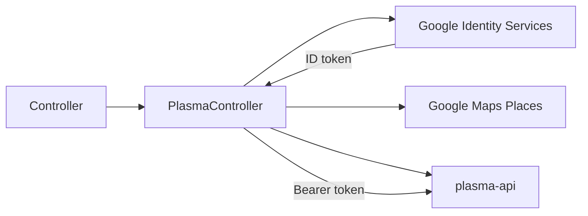
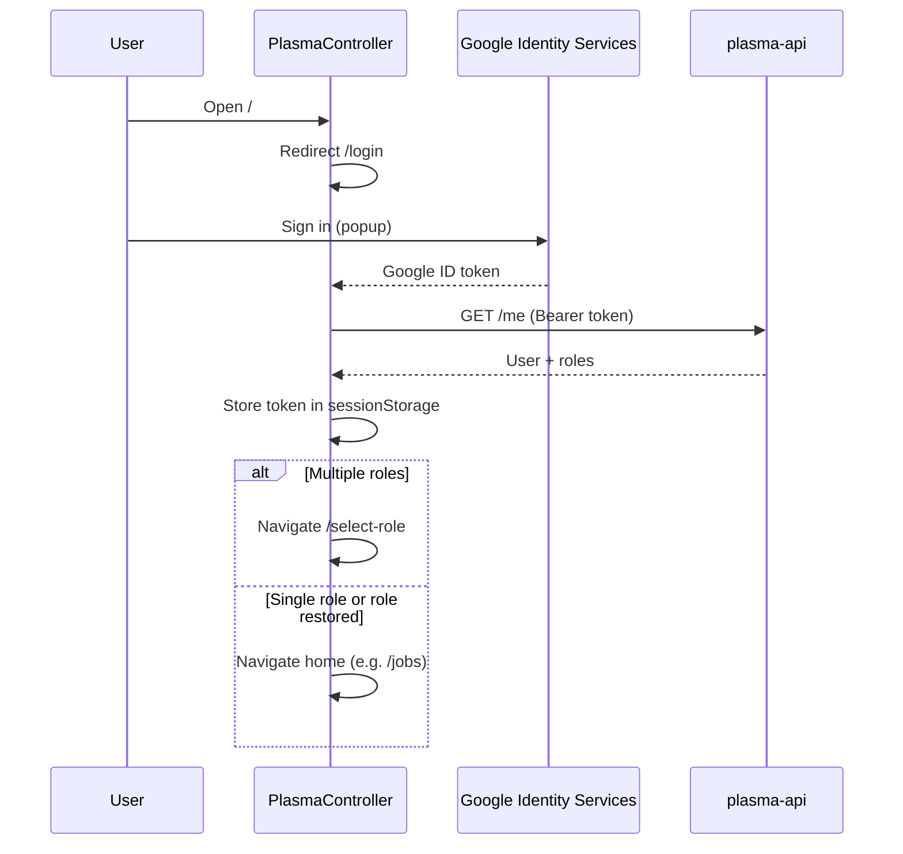

# Architecture

## Summary

Plasma Controller is a browser SPA built with React Router. Controllers sign in with Google Workspace, receive roles from the plasma-api backend, and use Jobs, Shifts, and Directory screens backed by real API calls. Auth, role selection, and capability-based navigation gate every protected route.

## Components

| Component | Responsibility | Location |
|-----------|----------------|----------|
| React Router SPA | Client routing and layouts | `app/routes.ts`, `app/routes/*` |
| Auth provider | Google ID token session, `GET /me`, role state | `app/lib/auth.tsx` |
| API client | Bearer auth, request IDs, 401 handling | `app/lib/api-client.ts` |
| Capabilities | Nav areas, path access, job-create permissions | `app/lib/capabilities.ts` |
| Protected layout | Auth gate, role selection, path checks | `app/routes/protected-layout.tsx` |
| Dashboard layout | Brand header, primary nav, user menu | `app/routes/dashboard-layout.tsx` |
| Jobs UI | Board, create/assign drawers, detail + lifecycle | `app/routes/jobs.tsx`, `app/routes/jobs.$jobId.tsx`, `app/lib/jobs.ts` |
| Shifts UI | Active shifts, logon/logoff | `app/routes/shifts.tsx`, `app/lib/shifts.ts` |
| Directory UI | Volunteer and bike search | `app/routes/directory.tsx`, `app/lib/directory.ts` |
| Places | Google Maps autocomplete for job locations | `app/lib/places.ts` |
| Backend (plasma-api) | Auth, jobs, shifts, directory | External; called via `VITE_API_BASE_URL` |

## Data / control flow

### Sign-in and session

On load, `AuthProvider` reads the stored token and calls `GET /me`. A 401 clears the session and returns the user to `/login`. Transient failures (network, 5xx) keep the session but may leave the user on a loading state briefly.

### Routes

| Path | Module | Notes |
|------|--------|--------|
| `/` | `_index.tsx` | Redirects to `/login` |
| `/login` | `login.tsx` | Public; Google Sign-In button |
| `/no-access` | `no-access.tsx` | Signed in but no Plasma roles |
| `/select-role` | `select-role.tsx` | Pick active role when user has 2+ roles |
| `/dashboard` | `dashboard.tsx` | Under `dashboard-layout`; placeholder |
| `/jobs` | `jobs.tsx` | Active/completed job board from API |
| `/jobs/new` | `jobs-new.tsx` | Opens new-job drawer (nested outlet) |
| `/jobs/new/assign` | `jobs-new-assign.tsx` | Opens assign-rider drawer |
| `/jobs/:jobId` | `jobs.$jobId.tsx` | Job detail, lifecycle actions, relay UI |
| `/shifts` | `shifts.tsx` | Active shifts; logon/logoff (admin/controller) |
| `/directory` | `directory.tsx` | Search volunteers and bikes |

All routes except `/login` sit under `protected-layout.tsx`, which enforces authentication, Plasma role access, role selection, and per-path capability checks.

### Primary navigation

`dashboard-layout.tsx` renders nav items from `navAreasForRole()` in `app/lib/capabilities.ts`. All Plasma roles (admin, controller, trustee, rider, driver) see **Jobs**, **Shifts**, and **Directory**.

Job creation and shift management are further restricted in the route components: only admin and controller roles can create jobs or log riders on/off shift.

## Key modules

| Module | Owns |
|--------|------|
| `app/root.tsx` | HTML shell, `AuthProvider` wrapper |
| `app/lib/auth.tsx` | Auth context, `loginWithCredential`, `logout`, `refreshUser` |
| `app/lib/auth-token.ts` | Google ID token in `sessionStorage` |
| `app/lib/active-role.ts` | Persisted active role across reloads |
| `app/lib/api-client.ts` | `apiFetch`, `ApiError`, `UNAUTHORIZED_EVENT` |
| `app/lib/roles.ts` | `Role` enum, `parseRoles`, labels |
| `app/lib/capabilities.ts` | Nav areas, `canAccessPath`, `canCreateJobs` |
| `app/lib/google-sign-in.ts` | Load GIS script, render official sign-in button |
| `app/lib/jobs.ts` | Job CRUD, lifecycle actions, relay |
| `app/lib/shifts.ts` | Active shifts, logon/logoff, volunteer/bike lists |
| `app/lib/directory.ts` | Volunteer and bike directory search |
| `app/lib/places.ts` | Google Maps Places autocomplete + geocoding |
| `app/lib/env.ts` | `VITE_API_BASE_URL`, `VITE_GOOGLE_CLIENT_ID`, `VITE_GOOGLE_MAPS_API_KEY` |
| `app/components/login-form.tsx` | Google Sign-In mount + error display |
| `app/components/user-menu.tsx` | User display, role badge, sign-out |

## API surface (client)

All calls go through `apiFetch` with `Authorization: Bearer <google_id_token>` unless `skipAuth` is set.

| Endpoint | Used by | Purpose |
|----------|---------|---------|
| `GET /me` | `auth.tsx` | Profile and roles after sign-in |
| `GET /jobs/active`, `GET /jobs/completed` | `jobs.ts` | Job board and detail lookup |
| `POST /jobs` | `jobs.ts` | Create delivery job |
| `POST /jobs/:id/actions/:action` | `jobs.ts` | Allocate, collect, deliver |
| `POST /jobs/:id/cancel` | `jobs.ts` | Cancel job |
| `POST /jobs/:id/relay` | `jobs.ts` | Convert to relay with rendezvous points |
| `GET /shifts/active` | `shifts.ts` | On-duty riders |
| `POST /shifts/logon` | `shifts.ts` | Start shift |
| `POST /shifts/:id/logoff` | `shifts.ts` | End shift |
| `GET /bikes`, `GET /volunteers` | `shifts.ts` | Logon form options |
| `GET /directory/volunteers` | `directory.ts` | Search volunteers |
| `GET /directory/bikes`, `GET /directory/bikes/:id` | `directory.ts` | Search bikes, mileage history |

Job statuses from the API: **New**, **Allocated**, **Collected**, **Delivered**, **Cancelled**. Relay jobs can have child legs.

## Persistence and caching

| Store | What | Lifetime |
|-------|------|----------|
| `sessionStorage` (`plasma.google_id_token`) | Google ID token | Tab session |
| `localStorage` (via `active-role.ts`) | Selected role when user has multiple | Until cleared or invalid |
| API (plasma-api) | Jobs, shifts, directory data | Server-side |
| In-memory React state | Fetched lists, form state | Component / page lifetime |

## Integrations

| System | Direction | Purpose |
|--------|-----------|---------|
| Google Identity Services | Inbound (browser) | Workspace sign-in; ID token for API |
| Google Maps Places | Inbound (browser) | Address autocomplete on job create/relay |
| plasma-api | Outbound | All business data and auth verification |
| Jira (CI) | Outbound from Actions | Link PR when title has `[KEY-123]` |

## Failure modes

| Failure | Behaviour |
|---------|-----------|
| Missing env vars | `getGoogleClientId()` / `getGoogleMapsApiKey()` throw at runtime on affected screens |
| GIS script load failure | Login shows error; user cannot sign in |
| `GET /me` returns 401 | Token cleared; user redirected to `/login` |
| `GET /me` returns 403 | Login form shows organisation-account message |
| API 401 on any call | `apiFetch` dispatches `plasma:unauthorized`; session cleared |
| No Plasma roles | Redirect to `/no-access` |
| Multi-role, no selection | Redirect to `/select-role` |
| Job not found | Detail page shows not-found state |
| Network / 5xx on refresh | Session kept; `refreshUser` leaves status authenticated |
