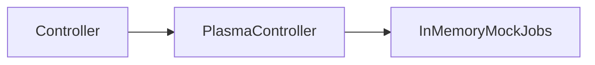
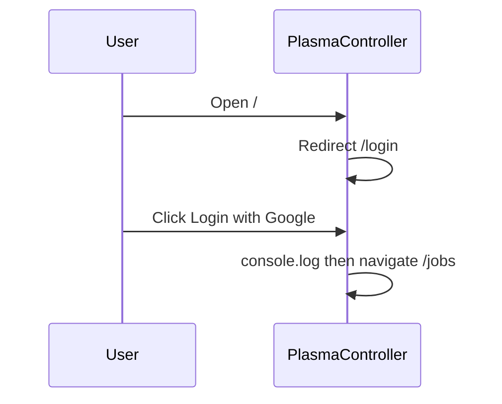

# Architecture

## Summary

Plasma Controller is a browser SPA built with React Router. The shell and jobs UI are in place; authentication and API access are stubs. Controllers can click through login into a mock jobs board, open new-job and assign-rider drawers, and use layout chrome (brand header, user menu).

## Components

| Component | Responsibility | Location |
|-----------|----------------|----------|
| React Router SPA | Client routing and layouts | `app/routes.ts`, `app/routes/*` |
| Login form | UI + stub “Google” click → `/jobs` | `app/components/login-form.tsx` |
| Dashboard layout | Brand header, outlet, user menu | `app/routes/dashboard-layout.tsx` |
| Jobs UI | Board, filters, nested drawers (mock) | `app/routes/jobs.tsx`, `app/components/*-drawer.tsx` |
| Backend / GIS | Not integrated in this revision | — |

## Data / control flow

### Current sign-in (stub)

There is no Google Identity Services load, no token storage, and no `GET /me` (or other) API call in `app/lib/`.

### Routes

| Path | Module | Notes |
|------|--------|--------|
| `/` | `_index.tsx` | Always redirects to `/login` |
| `/login` | `login.tsx` | Public login page |
| `/dashboard` | `dashboard.tsx` | Under `dashboard-layout`; not auth-gated |
| `/jobs` | `jobs.tsx` | Mock board |
| `/jobs/new` | `jobs-new.tsx` | Null child; opens new-job drawer |
| `/jobs/new/assign` | `jobs-new-assign.tsx` | Null child; opens assign drawer |

## Key modules

| Module | Owns |
|--------|------|
| `app/root.tsx` | HTML document, fonts, error boundary |
| `app/components/login-form.tsx` | Sign-in button stub |
| `app/components/user-menu.tsx` | Hardcoded user display; sign-out stub |
| `app/routes/dashboard-layout.tsx` | App chrome |
| `app/routes/jobs.tsx` | Mock jobs list + filters |
| `app/components/new-job-drawer.tsx` | Job intake sheet |
| `app/components/assign-rider-drawer.tsx` | Rider pick sheet |
| `app/lib/utils.ts` | Class-name helper |

## Persistence and caching

| Store | What | Lifetime |
|-------|------|----------|
| In-component mocks | Jobs, hospitals, riders | Lost on reload |
| Browser session / API | None yet | — |

## Integrations

| System | Direction | Purpose |
|--------|-----------|---------|
| Google Identity Services | Planned | Real Workspace sign-in (stub UI only today) |
| Backend API | Planned | Profile and job APIs (not called from this revision) |
| Jira (CI) | Outbound from Actions | Link PR when title has `[KEY-123]` |

## Failure modes

| Failure | Behaviour |
|---------|-----------|
| Stub login | Always “succeeds” locally by navigating; no credential check |
| Stub sign-out | Logs only; no session to clear |
| Job assign confirm | `console.log` only; no server error path |
| Missing job detail route | Navigation to `/jobs/:id` has no matching route |

When real auth lands, expect a protected layout, token storage, and an API client — document those in an update pass after they merge.
