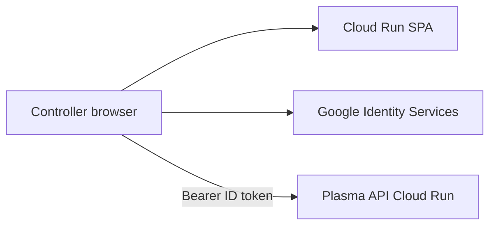

# GCP hosting

## Purpose

How Plasma Controller is hosted on Google Cloud Platform. This app is a React Router SPA (`ssr: false` in `react-router.config.ts`). **This repo deploys the SPA to Cloud Run** in `europe-west2` via Terraform workspaces (`staging` / `production`). Plasma API is planned separately on Cloud Run in the same region. Firebase Hosting remains a valid alternative (see Options) but is not wired here.

Operational steps (bootstrap, apply, GitHub Environments) are in [Cloud Run deploy](cloud-run.md).

## What we are hosting

`npm run build` emits:

| Output | Role |
|--------|------|
| `build/client/` | Static SPA (HTML, hashed JS/CSS, assets) |
| `build/server/index.js` | Node helper used by `react-router-serve` |

There are **no server-side secrets**. Vite bakes client config at **build** time (`app/lib/env.ts`):

| Variable | Required? | Notes |
|----------|-----------|--------|
| `VITE_API_BASE_URL` | Optional | Defaults to `http://localhost/api` |
| `VITE_GOOGLE_CLIENT_ID` | Yes when Google Sign-In mounts | Changing either variable after build requires a rebuild |

The [Dockerfile](../../Dockerfile) passes those as **build-args** on the `build-env` stage, then runs `npm run start` (`react-router-serve`). That server honours `PORT` (Cloud Run injects `8080`). Do not set `VITE_*` as Cloud Run runtime env.

## How this fits Plasma API

Plasma API (Laravel) is the backend. Jira [PLM-1](https://bloodbikeswales.atlassian.net/browse/PLM-1) / [PLM-19](https://bloodbikeswales.atlassian.net/browse/PLM-19) commit it to **Cloud Run**, **europe-west2**, Artifact Registry / Cloud Build, and Terraform. GCP projects already in use:

| Environment | GCP project | Terraform workspace |
|-------------|-------------|---------------------|
| Staging | `plasma-staging-502110` | `staging` |
| Production | `plasma-production` | `production` |

API CORS allows SPA origins via `FRONTEND_URL`. The SPA and API must share the **same Google OAuth Web client ID**. Cloud Run for the API is not in Terraform yet (secrets only today). After this SPA is deployed, add the Cloud Run URL to OAuth **Authorized JavaScript origins** and to API `FRONTEND_URL`.

BR-011 (data and compute in `europe-west2`) applies to **API data and compute**. The SPA is public JS/CSS.

## Options

### 1. Firebase Hosting

Serve `build/client/` as static files. SPA rewrite: unmatched paths → `/index.html`. Optional rewrite `/api/**` → the Cloud Run API (same origin; simpler CORS; `VITE_API_BASE_URL` can be `/api`).

Not implemented in this repository. Cheaper at the edge than Cloud Run for a pure static site; adds a Firebase product next to the API’s Cloud Run/Terraform path.

### 2. Cloud Run (in this repo)

Reuse `Dockerfile`. Same platform as the API. HTTPS via `*.run.app`. `react-router-serve` listens on `PORT`. Terraform in `infrastructure/` plus [`.github/workflows/deploy.yml`](../../.github/workflows/deploy.yml).

Pays compute to serve static files; first request after scale-to-zero can cold-start. CI must pass `VITE_*` as **Docker build-args**.

### 3. Cloud Storage + HTTPS Load Balancer + Cloud CDN (not first choice)

Textbook GCP static hosting. HTTPS custom domains **require** an [external Application Load Balancer](https://docs.cloud.google.com/storage/docs/hosting-static-website). That LB has a standing cost that is high for this traffic. Not implemented.

### Do not use

- **Firebase App Hosting** — SSR / framework product; this app is `ssr: false`
- **App Engine** — legacy for this use case
- **Public GCS website without a load balancer** — custom domains are HTTP-only

## In-repo path

**Host the SPA on Cloud Run** on `plasma-staging-502110` / `plasma-production`, region `europe-west2`. Keep Plasma API on Cloud Run. No custom domain in this pass.

Cache-Control / CDN header tuning is **out of scope**. Traffic is too low.

## Key paths

| Path | Role |
|------|------|
| `react-router.config.ts` | `ssr: false` |
| `app/lib/env.ts` | `VITE_API_BASE_URL`, `VITE_GOOGLE_CLIENT_ID` |
| `.env.example` | Local env template |
| `Dockerfile` | Node 24 Alpine; Vite build-args; `CMD npm run start` |
| `infrastructure/` | Terraform root (workspaces + tfvars) |
| `.github/workflows/ci.yml` | Lint, format, test on PRs |
| `.github/workflows/terraform.yml` | `terraform fmt` / `validate` when infra changes |
| `.github/workflows/deploy.yml` | Staging on `main`; production via `workflow_dispatch` |
| `docs/technical/cloud-run.md` | Bootstrap and operate Cloud Run |

## Pitfalls

- Pair workspace and tfvars. Never apply `production.tfvars` while the `staging` workspace is selected.
- `VITE_*` cannot be changed on a running revision without a new image build.
- First GitHub Actions deploy needs Artifact Registry and WIF from a laptop apply ([runbook](cloud-run.md)).
- Root `README.md` still describes SSR Docker deploy; this app is a SPA.
- Plasma API Cloud Run + secret injection is not in Terraform yet; set `FRONTEND_URL` when this SPA has a URL.

## Related

- [Cloud Run deploy](cloud-run.md)
- [Technical overview](overview.md)
- [Architecture](architecture.md)
- Non-technical: [Hosting](../non-technical/hosting.md)
- [PLM-1 Plasma API MVP](https://bloodbikeswales.atlassian.net/browse/PLM-1)
- [PLM-19 Serverless deployment on GCP](https://bloodbikeswales.atlassian.net/browse/PLM-19)
